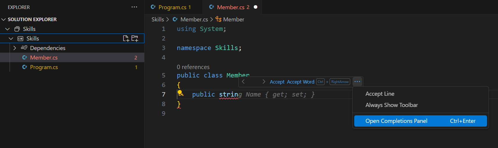

<header>

<!--
  <<< Author notes: Course header >>>
  Read <https://skills.github.com/quickstart> for more information about how to build courses using this template.
  Include a 1280×640 image, course name in sentence case, and a concise description in emphasis.
  In your repository settings: enable template repository, add your 1280×640 social image, auto delete head branches.
  Next to "About", add description & tags; disable releases, packages, & environments.
  Add your open source license, GitHub uses the MIT license.
-->

# Code with GitHub Copilot

_GitHub Copilot can help you code by offering autocomplete-style suggestions right in VS Code and Codespaces._

</header>

<!--
  <<< Author notes: Step 3 >>>
  Start this step by acknowledging the previous step.
  Define terms and link to docs.github.com.
-->

## Step 3: View the GitHub Copilot tab with multiple suggestions

_Nice work! You just used AI code suggestions within a C# file by using GitHub Copilot :sparkles:_

Keep in mind that as you continue to use copilot, you may not want some of the suggestions GitHub Copilot offers. GitHub Copilot will show you multiple suggestions in a new tab.

### :keyboard: Activity: Pull the latest code to the Codespace repo.

> **Note**
> Pull MUST be done prior to the next activity.

1. Use the VS Code terminal to pull the latest code:

   ```
   git pull
   ```

### :keyboard: Activity: Add another C# method and view all suggestions

1. From inside the codespace in the Solution Explorer, right click on the project, create a new file. 

> Note: If you closed the Codespace from above please open it back up or create a new Codespace.

2. Select **Class** and name the file `Member.cs`
3. In the `Member.cs` file, type the following function inside of the `Member` class.
   ```
   public strin
   ```
4. Stop typing and view the Copilot suggestion by hovering over the red squiggly and select the `...`
5. Click `Open Completions Panel`. 

   > **Note**
   > If you don't see the copilot code block suggestion or the red squiggly and the three dots `...`, you can type `control + enter` to bring up the GitHub Copilot completions panel.

6. Copilot will synthesize around 10 different code suggestions or press CTRL+Enter. You should see something like this:
   
7. Find a solution you like and click `Accept Solution`.
8. Your `Member.s` file will be updated with your solution.

### :keyboard: Activity: Push code to your repository from the codespace

1. Use the VS Code terminal to add the `Member.cs` file to the repository:

   ```
   git add Member.cs
   ```

2. Next from the VS Code terminal stage and commit the changes to the repository:

   ```
   git commit -m "Copilot second commit"
   ```

3. Finally from the VS Code terminal push to code to the repository:

   ```
   git push
   ```

**Wait about 60 seconds then refresh your repository landing page for the next step.**

<footer>

<!--
  <<< Author notes: Footer >>>
  Add a link to get support, GitHub status page, code of conduct, license link.
-->

---

Get help: [Post in our discussion board](https://github.com/orgs/skills/discussions/categories/code-with-copilot) &bull; [Review the GitHub status page](https://www.githubstatus.com/)

&copy; 2023 GitHub &bull; [Code of Conduct](https://www.contributor-covenant.org/version/2/1/code_of_conduct/code_of_conduct.md) &bull; [MIT License](https://gh.io/mit)

</footer>
