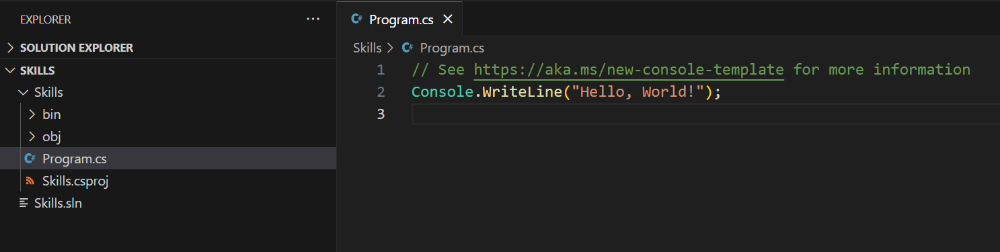

<header>

<!--
  <<< Author notes: Course header >>>
  Read <https://skills.github.com/quickstart> for more information about how to build courses using this template.
  Include a 1280×640 image, course name in sentence case, and a concise description in emphasis.
  In your repository settings: enable template repository, add your 1280×640 social image, auto delete head branches.
  Next to "About", add description & tags; disable releases, packages, & environments.
  Add your open source license, GitHub uses the MIT license.
-->

# Code with GitHub Copilot

_GitHub Copilot can help you code by offering autocomplete-style suggestions right in VS Code and Codespaces._

</header>

<!--
  <<< Author notes: Step 2 >>>
  Start this step by acknowledging the previous step.
  Define terms and link to docs.github.com.
-->

## Step 2: Seeing AI code suggestions in a C# file!

_Nice work! :tada: You created a Codespace using a devcontainer file that installed Copilot!_

GitHub Copilot provides suggestions for numerous languages and a wide variety of frameworks, but works especially well for Python, JavaScript, TypeScript, Ruby, Go, C# and C++. The following samples are in C#, but other languages will work similarly.

Let's try this out utilizing C# for Copilot.

### :keyboard: Activity: Add a C# file and start writing code

> **Note**:
> If you closed the Codespace from above, please open it back up or create a new Codespace.

1. Create a new .NET project by using the `.NET: New Project...` command and selecting `Console App`. 
1. Select a folder and name the project **Skills**.
1. Open `Program.cs`
1. Verify your new file looks like:
   
1. In the `Program.cs` file, remove any code and then type the following function header.

   ```csharp
   void CalculateNumbers(int var1, int var2)
   {
   ```

   GitHub Copilot will automatically suggest an entire function body in grayed text. Below is an example of what you'll most likely see, but the exact suggestion may vary.
   

5. Press `Tab` to accept the suggestion.

### :keyboard: Activity: Push code to your repository from the codespace

1. Use the VS Code terminal to add all files to the repository:

   ```
   git add -A
   ```

2. Next from the VS Code terminal stage and commit the changes to the repository:

   ```
   git commit -m "Copilot first commit"
   ```

3. Finally from the VS Code terminal push to code to the repository:

   ```
   git push
   ```

**Wait about 60 seconds then refresh your repository landing page for the next step.**

<footer>

<!--
  <<< Author notes: Footer >>>
  Add a link to get support, GitHub status page, code of conduct, license link.
-->

---

Get help: [Post in our discussion board](https://github.com/orgs/skills/discussions/categories/code-with-copilot) &bull; [Review the GitHub status page](https://www.githubstatus.com/)

&copy; 2023 GitHub &bull; [Code of Conduct](https://www.contributor-covenant.org/version/2/1/code_of_conduct/code_of_conduct.md) &bull; [MIT License](https://gh.io/mit)

</footer>
